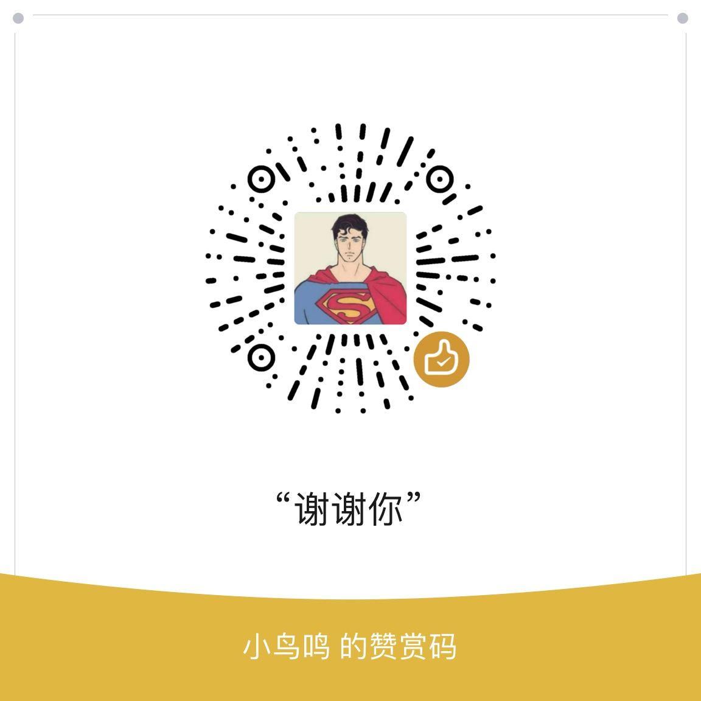

## 配置下发前端

平时我们是写 json  yaml  env 保存配置，这个模块意思就是，上传配置到服务器，通过key  获取 配置
公司内部有保密需求的，此项目应该有用处
# 后端地址
```
https://github.com/dividduang/option
```
# 使用方法
```
复制到对应的路径即可
option_ui\apps\web-antd\src\views\option\components\OptionForm.vue 第194行更换key
```
